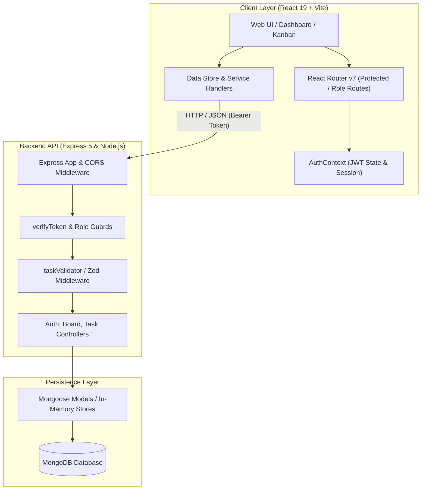
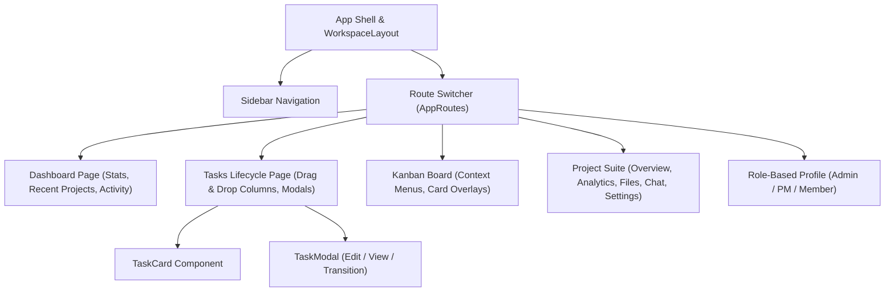
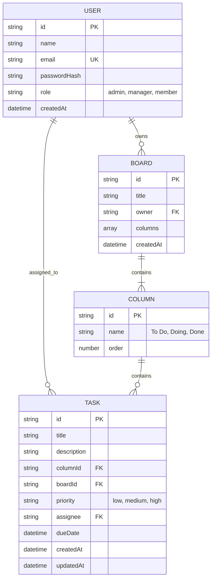

<div align="center">

# ⚡ CollabBoard - Modern Full-Stack Agile Workspace

> **A high-performance, real-time, role-aware project management and Kanban task orchestration suite.**

[](https://react.dev/)
[](https://nodejs.org/)
[](https://www.mongodb.com/)
[](https://jwt.io/)
[](https://reactrouter.com/)
[](LICENSE.md)

<br/>


<br/>
<br/>

**Built with ❤️ for rapid team collaboration, fluid drag-and-drop task lifecycles, role-based workflows, and enterprise-grade security.**

[Explore Features](#-feature-deep-dive) • [Architecture](#-system-architecture) • [API Docs](#-rest-api-reference) • [Quick Start](#-quick-start--installation) • [Roadmap](#-milestones--roadmap)

</div>

---

## 📑 Table of Contents

- [🌟 Project Highlights](#-project-highlights)
- [🏗️ System Architecture](#-system-architecture)
- [🛠️ Tech Stack Matrix](#-tech-stack-matrix)
- [🚀 Feature Deep-Dive](#-feature-deep-dive)
  - [🔐 Authentication & Role-Based Access Control (RBAC)](#-authentication--role-based-access-control-rbac)
  - [📊 Real-Time Interactive Dashboard](#-real-time-interactive-dashboard)
  - [📋 Kanban Board with Drag & Drop](#-kanban-board-with-drag--drop)
  - [📝 Task Lifecycle Engine & Interactive Modals](#-task-lifecycle-engine--interactive-modals)
  - [👥 Dynamic Role-Tailored Profiles](#-dynamic-role-tailored-profiles)
  - [📁 Project Hub Suite (Analytics, Files, Chat, Settings)](#-project-hub-suite)
- [📡 REST API Reference](#-rest-api-reference)
- [🗄️ Data Models & Schemas](#-data-models--schemas)
- [💻 Quick Start & Installation](#-quick-start--installation)
- [🧪 Testing & API Verification](#-testing--api-verification)
- [📂 Codebase Structure](#-codebase-structure)
- [🗺️ Milestones & Roadmap](#-milestones--roadmap)
- [🤝 Contributing & Guidelines](#-contributing--guidelines)
- [📜 License](#-license)

---

## 🌟 Project Highlights

<div align="center">
  
  <p><em>Frontend + Backend working in absolute harmony ✨</em></p>
</div>

- ⚡ **Cutting-Edge Stack**: Powered by **React 19**, **Vite 8**, **React Router v7**, **Node.js**, **Express 5**, and **MongoDB / Mongoose**.
- 🎯 **HTML5 Drag-and-Drop Task Board**: Seamless column transitions with active visual drop targets, real-time state mutation, and backend persistence.
- 🛡️ **End-to-End JWT Auth & Multi-Tier RBAC**: Granular permissions across `Admin`, `Project Manager`, and `Team Member` tiers.
- 📈 **Comprehensive Analytics & Dashboard**: Visual project progress bars, deadline countdowns, activity feeds, velocity metrics, and burndown indicators.
- 🎨 **Sleek Glassmorphism & Micro-Interactions**: Modern UI design system with Lucide icons, custom responsive CSS modules, smooth transitions, and glowing priority badges.
- 🔌 **Standardized REST API**: Complete CRUD suite for Tasks, Boards, and Auth with structured error payloads and query filtering.

[⬆ Back to Top](#-table-of-contents)

---

## 🏗️ System Architecture

### High-Level Architecture Flow



### Component Hierarchy & Data Flow



[⬆ Back to Top](#-table-of-contents)

---

## 🛠️ Tech Stack Matrix

| Domain | Technology | Description |
|---|---|---|
| **Frontend Framework** | `React 19.2` | Core rendering engine utilizing modern hooks & concurrent features |
| **Build Tooling** | `Vite 8.2` | Lightning-fast HMR and optimized production bundle compilation |
| **Routing** | `React Router 7.18` | Declarative client-side routing with nested auth & role guards |
| **Icons & UI** | `Lucide React 1.32` | Clean, crisp, feather-light SVG icon set |
| **Schema Validation** | `Zod 4.4` | Strict type validation for payloads and form contracts |
| **Backend Runtime** | `Node.js` + `Express 5.2` | Scalable REST API with modular route controllers |
| **Database** | `MongoDB` + `Mongoose 9.9` | NoSQL document storage with structured schema modeling |
| **Authentication** | `JWT` + `Bcrypt.js 3.0` | Stateless Bearer token verification with salt-hashed passwords |
| **Code Quality** | `ESLint 10` + `Prettier 3.9` | Automated code formatting and strict linting rules |

[⬆ Back to Top](#-table-of-contents)

---

## 🚀 Feature Deep-Dive

### 🔐 Authentication & Role-Based Access Control (RBAC)

<div align="center">
  
  <p><em>"You Shall Not Pass... without a valid Bearer JWT!"</em></p>
</div>

CollabBoard implements a secure, stateless authentication pipeline with token persistence in `localStorage` and dynamic route guards:

- **JWT Lifecycle**: Tokens are generated on `/api/auth/login` and `/api/auth/register`, verified via `verifyToken.js` middleware, and checked on page bootstrap with `/api/auth/me`.
- **Role Tiering**:
  - 👑 **Admin**: Complete system overview, team management, user deactivation, audit logs, and global board controls.
  - 💼 **Project Manager**: Project planning, milestone tracking, velocity graphs, task delegation, and budget allocation.
  - 👤 **Team Member**: Task status updates, kanban collaboration, chat participation, and personal profile analytics.
- **Route Guarding**:
  - `ProtectedRoute`: Automatically routes unauthenticated traffic to `/login`.
  - `GuestRoute`: Bounces authenticated sessions away from login/register back to `/dashboard`.
  - `RoleRoute`: Validates user role against allowed arrays (`allowed={['admin', 'manager']}`) and safely bounces unauthorized roles.

---

### 📊 Real-Time Interactive Dashboard

The command center for every developer and team lead:

- **Metric Stat Cards**: Instant counters for `Total Projects`, `Active Projects`, `My Tasks`, and `Overdue Tasks`.
- **Recent Projects Table**: Real-time progress bars with dynamic status indicators (`ACTIVE`, `IN REVIEW`, `COMPLETED`).
- **My Tasks Widget**: Filtered view of assigned tasks sorted by urgency with color-coded priority pills (`HIGH`, `MEDIUM`, `LOW`).
- **Activity Stream & Upcoming Deadlines**: Real-time audit logs of task transitions, comments, and sprint cutoffs.

---

### 📋 Kanban Board with Drag & Drop

<div align="center">
  
  <p><em>Dragging tasks into 'Done' on Friday afternoon like a boss 😎</em></p>
</div>

- **Dynamic Columns**: `To Do`, `In Progress`, `Review`, and `Done` workflow columns.
- **Native HTML5 Drag & Drop**: Drag cards across columns with instant visual drop-target highlights and automatic optimistic state updates.
- **Context Menus**: Right-click or button-trigger quick actions: Move Left/Right, Change Priority, Duplicate, or Delete.
- **Visual Priority Indicators**: High-priority tasks glow with warm amber/rose accents, low-priority tasks with calm emerald tones.

---

### 📝 Task Lifecycle Engine & Interactive Modals

Managing tasks is effortless with the built-in modal editor:

<details>
<summary><b>🔍 Click to expand Task Modal capabilities</b></summary>

- **In-Place Detail Editing**: Edit task title, rich markdown description, due date, assignee, and priority in a single popup.
- **State Transition Selector**: Seamlessly promote a task between columns (`col-todo` ➔ `col-inprogress` ➔ `col-review` ➔ `col-done`).
- **Safety Confirmations**: Deletion requires explicit confirmation to prevent accidental data loss.
- **Keyboard Shortcuts**: `ESC` to close, `Enter` / `Ctrl+S` to save.

</details>

---

### 👥 Dynamic Role-Tailored Profiles

The `/profile` route automatically resolves to the custom-tailored interface matching the logged-in user's role:

- **Admin Profile (`/profiles/admin`)**:
  - User directory with search, filtering, and role elevation/demotion buttons.
  - System performance gauges and security audit timeline.
- **Project Manager Profile (`/profiles/project-manager`)**:
  - Sprint velocity charts, project health scores, resource distribution graphs.
- **User Profile (`/profiles/user`)**:
  - Assigned workload matrix, personal skill tags, notification toggles, and security settings.

---

### 📁 Project Hub Suite

A unified workspace with dedicated sub-pages for every project aspect:

- 📊 **Analytics (`/features/projects/analytics`)**: Sprint velocity, burn-down trends, completed vs backlog ratios.
- 💬 **Chat (`/features/projects/chat`)**: Channel-based team messaging stream with instant feedback.
- 📂 **Files (`/features/projects/files`)**: Project asset repository, file categorization, upload manager.
- ⚙️ **Settings (`/features/projects/settings`)**: Board configurations, access rights, and the Danger Zone.

[⬆ Back to Top](#-table-of-contents)

---

## 📡 REST API Reference

**Base URL**: `http://localhost:5000/api`

### 🔑 Authentication Endpoints

| Method | Endpoint | Access | Body Payload | Description |
|---|---|---|---|---|
| `POST` | `/auth/register` | Public | `{ name, email, password, role }` | Registers user, hashes password, returns JWT |
| `POST` | `/auth/login` | Public | `{ email, password }` | Authenticates credentials, returns JWT & user object |
| `GET` | `/auth/me` | Bearer Token | `None` | Returns authenticated user profile |

### 📋 Board Endpoints

| Method | Endpoint | Access | Body Payload | Description |
|---|---|---|---|---|
| `GET` | `/boards` | Bearer Token | `None` | Fetch all boards for user |
| `POST` | `/boards` | Bearer Token | `{ title, columns }` | Create a new board with workflow columns |
| `GET` | `/boards/:id` | Bearer Token | `None` | Fetch specific board metadata and columns |
| `DELETE` | `/boards/:id` | Admin/Manager | `None` | Delete board |

### 📝 Task Endpoints

| Method | Endpoint | Access | Query / Body Payload | Description |
|---|---|---|---|---|
| `GET` | `/tasks` | Bearer Token | `?boardId=...&columnId=...` | Fetch all tasks with optional column/board filters |
| `GET` | `/tasks/:id` | Bearer Token | `None` | Fetch single task by ID |
| `POST` | `/tasks` | Bearer Token | `{ title, description, columnId, priority, ... }` | Create a new task card (201 Created) |
| `PUT` | `/tasks/:id/move` | Bearer Token | `{ targetColumnId }` | Move task to new column (Drag & Drop) |
| `PUT` | `/tasks/:id` | Bearer Token | Full Task Object | Full task update |
| `PATCH` | `/tasks/:id` | Bearer Token | Partial Task Fields | Partial update (e.g. priority, assignee) |
| `DELETE` | `/tasks/:id` | Bearer Token | `None` | Permanently remove task card |

<details>
<summary><b>📦 Click to view Example Request & Response Payloads</b></summary>

#### Create Task Request (`POST /api/tasks`)
```json
{
  "title": "Implement JWT Refresh Tokens",
  "description": "Add silent token rotation for enhanced session persistence.",
  "columnId": "col-todo",
  "boardId": "board-1",
  "priority": "high",
  "assignee": "user-1",
  "dueDate": "2026-09-01T23:59:59.000Z"
}
```

#### Task Response (`201 Created`)
```json
{
  "id": "task_1724741200000",
  "title": "Implement JWT Refresh Tokens",
  "description": "Add silent token rotation for enhanced session persistence.",
  "columnId": "col-todo",
  "boardId": "board-1",
  "priority": "high",
  "assignee": "user-1",
  "dueDate": "2026-09-01T23:59:59.000Z",
  "createdAt": "2026-08-27T12:00:00.000Z",
  "updatedAt": "2026-08-27T12:00:00.000Z"
}
```

#### Error Envelope (`400 Bad Request`)
```json
{
  "error": {
    "message": "Field 'title' is required and cannot be empty."
  }
}
```

</details>

[⬆ Back to Top](#-table-of-contents)

---

## 🗄️ Data Models & Schemas



[⬆ Back to Top](#-table-of-contents)

---

## 💻 Quick Start & Installation

<div align="center">
  
  <p><em>Get the entire full-stack app running locally in under 2 minutes! 🚀</em></p>
</div>

### Prerequisites
- **Node.js**: `v18.0.0` or higher ([Download](https://nodejs.org/))
- **npm**: `v9.0.0` or higher
- **MongoDB**: (Optional for in-memory mode, required for full DB persistence)

---

### Step 1: Clone the Repository
```bash
git clone https://github.com/nschandunu/full_stack_workshop.git
cd full_stack_workshop
```

---

### Step 2: Set Up Environment Variables

#### Backend `.env` (`collabboard-backend/.env`)
```env
PORT=5000
JWT_SECRET=super_secret_collabboard_jwt_key_2026_change_in_production
JWT_EXPIRES_IN=7d
MONGODB_URI=mongodb://localhost:27017/collabboard
```

---

### Step 3: Install Dependencies

#### Install Root & Client Dependencies
```bash
npm install
npm --prefix client install
```

#### Install Backend Dependencies
```bash
cd collabboard-backend
npm install
cd ..
```

---

### Step 4: Run the Development Servers

Open two terminal windows or run concurrently:

#### Terminal 1 — Start the Backend API
```bash
cd collabboard-backend
npm run dev
# Backend server runs on http://localhost:5000
```

#### Terminal 2 — Start the Frontend Client
```bash
cd client
npm run dev
# Client app runs on http://localhost:5173
```

Visit [`http://localhost:5173`](http://localhost:5173) in your browser! 🎉

[⬆ Back to Top](#-table-of-contents)

---

## 🧪 Testing & API Verification

We provide automated test scripts and cURL recipes to verify endpoints end-to-end.

### Automated Task API Test Suite
Run the built-in integration test suite:
```bash
cd collabboard-backend
npm test
```

Expected output:
```text
GET /api/tasks: true
GET /api/tasks?columnId=col-inprogress: true
POST /api/tasks: true
PUT /api/tasks/:id/move: true
PATCH /api/tasks/:id: true
DELETE /api/tasks/:id: true
```

<details>
<summary><b>🛠️ Click for Quick cURL Command Recipes</b></summary>

```bash
# 1. Register a new user
curl -X POST http://localhost:5000/api/auth/register \
  -H "Content-Type: application/json" \
  -d '{"name":"Senuka","email":"senuka@test.com","password":"password123","role":"manager"}'

# 2. Fetch all tasks
curl -X GET http://localhost:5000/api/tasks

# 3. Create a task
curl -X POST http://localhost:5000/api/tasks \
  -H "Content-Type: application/json" \
  -d '{"title":"Refactor UI","columnId":"col-todo","priority":"high"}'

# 4. Move a task to In Progress
curl -X PUT http://localhost:5000/api/tasks/task-1/move \
  -H "Content-Type: application/json" \
  -d '{"targetColumnId":"col-inprogress"}'
```

</details>

[⬆ Back to Top](#-table-of-contents)

---

## 📂 Codebase Structure

```text
full_stack_workshop/
├── 📄 AUTH.md                              # Authentication & RBAC technical specification
├── 📄 README.md                            # Comprehensive project guide & documentation
├── 📄 package.json                         # Root workspace package scripts & prettier
│
├── 📁 client/                              # React 19 Frontend Application
│   ├── 📁 src/
│   │   ├── 📁 assets/                     # Static media, icons, and branding
│   │   ├── 📁 components/                 # Global UI, Layouts & Routing elements
│   │   │   ├── 📁 layout/                 # Sidebar, AuthLayout, Header components
│   │   │   ├── 📁 routing/                # ProtectedRoute, GuestRoute, RoleBasedProfile
│   │   │   └── 📁 ui/                     # Reusable Buttons, Modals, Badges, Inputs
│   │   ├── 📁 context/                    # AuthContext (JWT, user state, login/logout)
│   │   ├── 📁 features/                   # Domain-Driven Feature Modules
│   │   │   ├── 📁 admin/                  # Admin Profile & User Management
│   │   │   ├── 📁 dashboard/              # Stats Cards, Projects, Tasks, Activity Feed
│   │   │   ├── 📁 project-manager-profile/# PM Control Center & Velocity Metrics
│   │   │   ├── 📁 projects/               # Project Hub (Kanban, Overview, Files, Chat)
│   │   │   │   └── 📁 kanban/             # Drag & Drop Board, Context Menus, Cards
│   │   │   ├── 📁 tasks/                  # TaskCard, TaskModal, TasksPage Lifecycle
│   │   │   └── 📁 users/                  # User Profile & Settings
│   │   ├── 📁 lib/                        # In-memory data store & mock definitions
│   │   ├── 📁 pages/                      # Login & Register views
│   │   ├── 📁 routes/                     # AppRoutes (Central route registry)
│   │   ├── 📁 services/                   # Axios / Fetch API wrappers (authService)
│   │   ├── 📄 App.jsx                     # Application bootstrap wrapper
│   │   └── 📄 main.jsx                    # Vite DOM entry point
│   ├── 📄 package.json                    # Client dependencies (React 19, Lucide, Router v7)
│   └── 📄 vite.config.js                  # Vite configuration & plugin setup
│
├── 📁 collabboard-backend/                 # Express 5 REST API Server
│   ├── 📁 controllers/                    # Request controllers (auth, board, task)
│   ├── 📁 middleware/                     # verifyToken, taskValidator, error handler
│   ├── 📁 models/                         # Mongoose Models & Stores (User, Board, Task)
│   ├── 📁 routes/                         # Route routers (/api/auth, /api/boards, /api/tasks)
│   ├── 📄 server.js                       # Express app bootstrap & route registration
│   ├── 📄 test-task-api.js                # Automated Task API integration tests
│   └── 📄 TASK_API_GUIDE.md               # Task API cURL testing & endpoint spec
│
└── 📁 doc/                                # Architectural Blueprints & Wireframes
    ├── 📄 CollabBoard-API-Contract-Frontend-Expectations.md
    ├── 📄 CollabBoard-Component-Tree-Architecture.md
    ├── 📄 CollabBoard-State-Management-Plan.md
    └── 📄 CollabBoard-UI-Wireframe-Overview.md
```

[⬆ Back to Top](#-table-of-contents)

---

## 🗺️ Milestones & Roadmap

```
[==================================== 75% Completed ===================================>   ]
```

- [x] **Milestone 1: Foundations & Architecture**
  - [x] Initialize Vite + React 19 client and configure Prettier/ESLint.
  - [x] Scaffold Component Tree Architecture and UI Wireframes (`doc/`).
  - [x] Set up Express 5 backend server structure with global error handling.

- [x] **Milestone 2: Core Features & Role-Based Auth**
  - [x] Build JWT Authentication (`/api/auth/register`, `/api/auth/login`, `/api/auth/me`).
  - [x] Implement multi-tier RBAC (`admin`, `manager`, `member`) with dynamic routing.
  - [x] Create Interactive Kanban Board with HTML5 Drag-and-Drop column transitions.
  - [x] Implement Task Lifecycle Management with interactive `TaskModal` & `TaskCard`.
  - [x] Build Project Hub sub-pages (Overview, Analytics, Files, Chat, Settings).
  - [x] Add automated test suite for Task CRUD endpoints (`test-task-api.js`).

- [ ] **Milestone 3: Database & Real-Time Sync (Upcoming)**
  - [ ] Connect production MongoDB via Mongoose models.
  - [ ] Integrate Socket.io for real-time multiplayer board updates & cursor presence.
  - [ ] Implement live chat websockets & file attachment uploads.

<div align="center">
  
  <p><em>Milestone 2 crushed! Onward to Real-Time WebSockets & MongoDB persistence 🚀</em></p>
</div>

[⬆ Back to Top](#-table-of-contents)

---

## 🤝 Contributing & Guidelines

1. **Fork the Repository** & create your feature branch:
   ```bash
   git checkout -b feature/amazing-feature
   ```
2. **Follow Code Quality Rules**:
   ```bash
   npm run format          # Run Prettier format
   npm --prefix client run lint # Check ESLint rules
   ```
3. **Commit Your Changes**:
   ```bash
   git commit -m "feat: add super cool drag animation"
   ```
4. **Push to Branch & Open a Pull Request**!

---

## 📜 License

Distributed under the **MIT License**. See [`LICENSE.md`](LICENSE.md) for more information.

<div align="center">
  <sub>CollabBoard Full-Stack Workshop Project • Crafted with Passion & Modern Web Technologies ⚡</sub>
</div>
